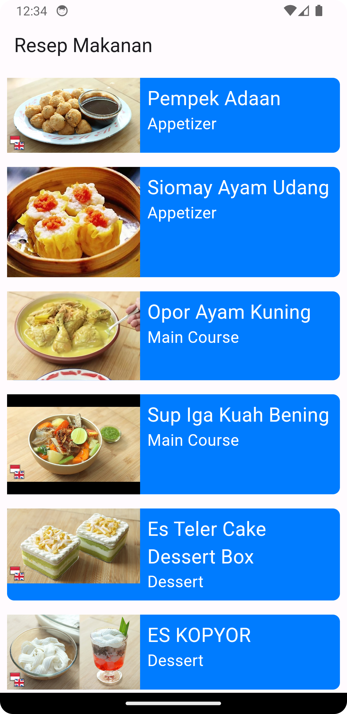
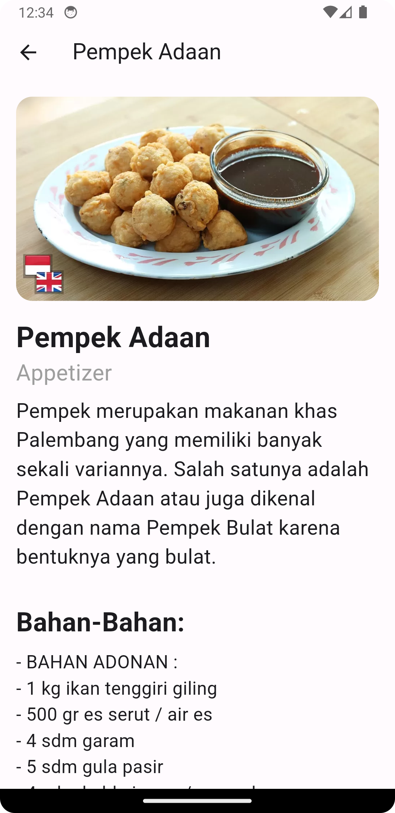
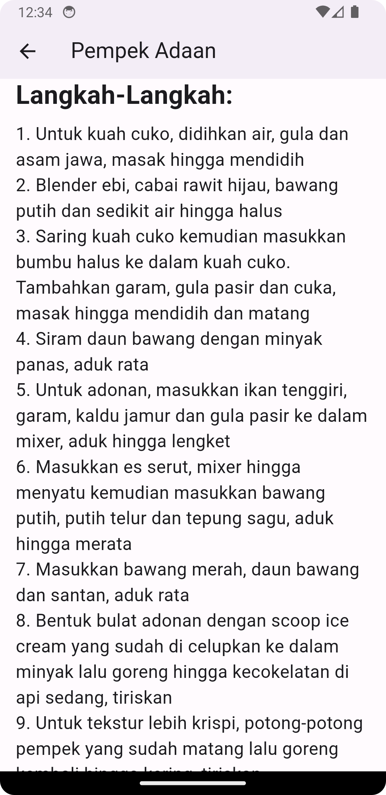

# Recipe App
 

Aplikasi Recipe App menyediakan beragam fitur interaktif, termasuk kategori masakan, panduan langkah demi langkah dengan serta daftar bahan-bahan yang dibutuhkan. Menggunakan framework Flutter dengan bahasa pemrograman Dart, aplikasi ini menjanjikan pengalaman yang responsif dan mudah digunakan bagi para pengguna.

## Nama Kelompok
<table border="1">
  <thead>
    <tr>
      <td>No</td>
      <td>NIM</td>
      <td>Nama Anggota</td>
    </tr>
  <thead>
  <tbody>
    <tr>
      <td>1</td>
      <td>19220318</td>
      <td>Diah Ayu Ambarwati</td>
    </tr>
    <tr>
      <td>2</td>
      <td>19220534</td>
      <td>Diharyumna Febrian</td>
    </tr>
    <tr>
      <td>3</td>
      <td>19221450</td>
      <td>Lusiana Alam Jembar</td>
    </tr>
    <tr>
      <td>4</td>
      <td>19221527</td>
      <td>Safira Chairunissa</td>
    </tr>
    <tr>
    <td>5</td>
    <td>19221006</td>
    <td>Yohana</td>    
    </tr>
  </tbody>
</table>

## 💻 Pengguna Sistem
Pengguna yang dapat memakai sistem ini adalah User.

## 👨‍💻 Skenario Kebutuhan Pengguna

### User
<ol>
  <li>User bisa Melihat Beranda</li>
  <li>User bisa memilih resep</li>
  <li>User bisa melihat detail resep</li>
</ol>

## 🖼 Screenshot Aplikasi
<table width="100%">
  <tbody>
    <tr>
      <td width="33%">
        <h5>Beranda</h5>
         
      </td>
      <td width="33%">
        <h5>Detail Resep 1</h5>
        
      </td>
      <td width="33%">
        <h5>Detail Resep 2</h5>
        
      </td>
    </tr>
  </tbody>
</table>
<!-- Boleh tambahkan jumlah screenshot lebih dari 3 gambar agar lebih lengkap dalam pengenalan aplikasinya -->

## 📝 Prerequisite
Untuk menjalankan aplikasi ini disarankan untuk menyiapkan aplikasi berikut ini :
- [x] Android Studio Giraffe <code>2022.03.1 Patch 1</code>
- [x] Flutter <code>3.13.2</code>
- [x] Dart <code>3.1.0</code>
- [x] Java JDK <code>19.0.0</code>
- [x] Git <code>2.35.1</code>

## Credit
Project ini mengacu pada modul praktik dari mata kuliah Mobile Programming Universitas Bina Sarana Informatika (UBSI) yang diampu oleh Bpk. <a href="https://github.com/yuris60">Yuris Alkhalifi, M.Kom., CPDSA</a> selaku Dosen.